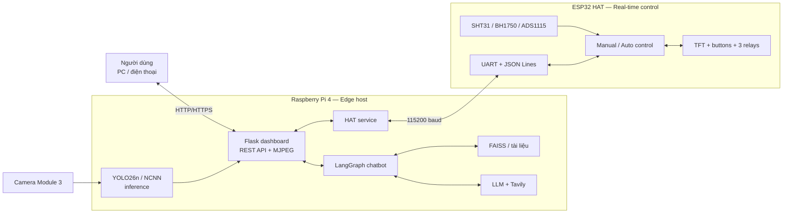

# TomatoGuard Edge — Hệ thống AIoT giám sát cây cà chua

> Đồ án tốt nghiệp kết hợp Computer Vision, Edge AI, IoT và trợ lý AI để nhận diện 6 nhóm bệnh/thiếu dinh dưỡng trên lá cà chua, theo dõi môi trường và điều khiển thiết bị tại trạm.


## Tổng quan

TomatoGuard Edge xử lý hình ảnh ngay trên **Raspberry Pi 4** bằng model **YOLO26n** đã export sang **NCNN**. Kết quả nhận diện, video, số liệu cảm biến và trạng thái relay được hợp nhất trên Flask dashboard. Một **ESP32 HAT** đảm nhiệm các tác vụ thời gian thực: đọc cảm biến, điều khiển relay, xử lý nút nhấn và cập nhật màn hình TFT. Hai bo mạch trao đổi dữ liệu JSON qua UART.

Hệ thống còn tích hợp chatbot nông nghiệp theo kiến trúc **LangGraph + RAG/FAISS + LLM + Tavily**, có thể sử dụng bệnh vừa phát hiện và trạng thái hiện tại của trạm làm ngữ cảnh tư vấn. Chatbot chỉ tư vấn; không tự ý điều khiển phần cứng.

### Project factsheet

| Hạng mục | Thông tin đã triển khai |
|---|---|
| Bài toán thị giác máy tính | Object detection trên lá cà chua, 6 lớp |
| Model huấn luyện | Ultralytics YOLO26n, ảnh đầu vào `640 × 640` |
| Edge inference | NCNN trên Raspberry Pi 4; model `.pt` dùng để thử ảnh trên laptop |
| Camera | Raspberry Pi Camera Module 3 |
| Bộ điều khiển thời gian thực | ESP32 HAT, firmware C++/Arduino hoặc PlatformIO |
| Cảm biến | SHT31, BH1750, ADS1115 và cảm biến độ ẩm đất analog |
| Thiết bị chấp hành | 3 relay: đèn, quạt và bơm |
| Giao tiếp Pi–ESP32 | UART 115200 baud, JSON Lines, heartbeat/telemetry/ACK |
| Web application | Flask, MJPEG video stream, responsive dashboard, REST API |
| Trợ lý AI | LangGraph, FAISS, OpenAI/OpenRouter/Gemini và Tavily |
| Chế độ vận hành | Web dashboard, HDMI/VNC display và nhận diện ảnh tĩnh trên laptop |

## Kết quả nổi bật

Model được huấn luyện 100 epoch với seed 42 và đánh giá trên validation set. Số liệu dưới đây lấy trực tiếp từ [`training_results/results.csv`](yolo26n_tomato_6cls_complete/training_results/results.csv) tại epoch 100:

| Chỉ số validation | Kết quả |
|---|---:|
| Precision | **85,49%** |
| Recall | **78,84%** |
| mAP@50 | **84,44%** |
| mAP@50–95 | **50,99%** |

> Các chỉ số trên mô tả kết quả validation của model, không phải benchmark tốc độ trên Raspberry Pi. Tốc độ thực tế phụ thuộc model export, phần cứng, tần suất suy luận và cấu hình camera.

Các artifact phục vụ kiểm chứng và làm slide có sẵn tại:

- [`results.png`](yolo26n_tomato_6cls_complete/training_results/results.png): đường cong huấn luyện và validation;
- [`confusion_matrix.png`](yolo26n_tomato_6cls_complete/training_results/confusion_matrix.png): confusion matrix;
- [`BoxPR_curve.png`](yolo26n_tomato_6cls_complete/training_results/BoxPR_curve.png): precision–recall curve;
- [`val_batch0_pred.jpg`](yolo26n_tomato_6cls_complete/training_results/val_batch0_pred.jpg): ví dụ dự đoán trên validation set;
- [`SYSTEM_ARCHITECTURE.md`](SYSTEM_ARCHITECTURE.md): sơ đồ kiến trúc tổng thể bằng Mermaid.

## Chức năng chính

- Nhận diện bệnh/thiếu dinh dưỡng theo thời gian thực từ Camera Module 3.
- Stream video MJPEG và hiển thị bounding box, nhãn, confidence trên dashboard.
- Đo inference time, draw time, tổng thời gian xử lý và FPS hiệu dụng.
- Đọc nhiệt độ, độ ẩm không khí, ánh sáng và độ ẩm đất từ ESP32 HAT.
- Điều khiển đèn, quạt, bơm ở chế độ manual; hỗ trợ chế độ auto trong firmware.
- Đồng bộ trạng thái và lệnh giữa Pi–ESP32 bằng heartbeat, telemetry và ACK có timeout.
- Chụp ảnh từ dashboard hoặc sự kiện nút nhấn trên HAT và lưu vào thẻ nhớ.
- Tư vấn nông nghiệp có ngữ cảnh bằng RAG, LLM và tìm kiếm web.
- Đăng nhập dashboard, CSRF protection và cấu hình secure cookie khi triển khai HTTPS.
- Hỗ trợ chạy web trong LAN hoặc triển khai qua Cloudflare Tunnel.

## Sáu lớp nhận diện

| ID | Nhãn tiếng Anh | Tên tiếng Việt |
|---:|---|---|
| 0 | Late blight | Bệnh mốc sương |
| 1 | Leaf miner | Sâu vẽ bùa |
| 2 | Magnesium deficiency | Thiếu magiê |
| 3 | Nitrogen deficiency | Thiếu nitơ |
| 4 | Potassium deficiency | Thiếu kali |
| 5 | Spotted wilt virus | Virus đốm héo |

Thứ tự lớp được định nghĩa trong [`tomato_6cls.yaml`](yolo26n_tomato_6cls_complete/tomato_6cls.yaml) và được kiểm tra khi ứng dụng nạp model.

## Kiến trúc hệ thống



Luồng hoạt động chính:

1. Camera gửi frame cho Raspberry Pi; YOLO suy luận trên một worker riêng.
2. Flask cung cấp video, detection, telemetry và lệnh điều khiển cho dashboard.
3. ESP32 đọc cảm biến, cập nhật TFT và điều khiển ba relay theo chế độ manual/auto.
4. Pi và ESP32 trao đổi telemetry, heartbeat, command và ACK qua UART.
5. Chatbot kết hợp câu hỏi, bệnh đã phát hiện, dữ liệu trạm, FAISS và nguồn web để tạo tư vấn.

Xem kiến trúc chi tiết tại [`SYSTEM_ARCHITECTURE.md`](SYSTEM_ARCHITECTURE.md) và giao thức HAT tại [`HAT_INTEGRATION.md`](HAT_INTEGRATION.md).

## Công nghệ sử dụng

| Lớp | Công nghệ |
|---|---|
| Computer Vision | Python, Ultralytics YOLO26n, OpenCV, NCNN |
| Edge/Web | Raspberry Pi OS 64-bit, Flask, MJPEG, HTML/CSS/JavaScript |
| Embedded/IoT | ESP32, C++/Arduino, FreeRTOS tasks, UART, I2C, SPI |
| AI assistant | LangGraph, LangChain, FAISS, sentence-transformers, Tavily |
| LLM provider | OpenRouter, OpenAI hoặc Google Gemini |
| Deployment | Bash, systemd, Cloudflare Tunnel, environment variables |
| Testing | Pytest, unittest, Node.js dashboard checks, C++ controller tests |

## Phần cứng

| Thành phần | Vai trò |
|---|---|
| Raspberry Pi 4 Model B (khuyến nghị 4 GB+) | Edge inference, web server và chatbot |
| Raspberry Pi Camera Module 3 | Thu nhận ảnh lá cà chua |
| ESP32 HAT | Điều khiển I/O và giao tiếp thời gian thực |
| SHT31 | Nhiệt độ và độ ẩm không khí |
| BH1750 | Cường độ ánh sáng |
| ADS1115 + cảm biến độ ẩm đất | Chuyển đổi và đọc tín hiệu analog |
| TFT ILI9341 3,2 inch | Hiển thị trạng thái tại trạm |
| Module 3 relay | Điều khiển đèn, quạt và bơm |
| MicroSD 32 GB+ và nguồn 5 V/3 A | Lưu trữ và cấp nguồn cho Raspberry Pi |

## Cài đặt trên Raspberry Pi

### 1. Lấy mã nguồn

```bash
git clone <repository-url>
cd Software
```

### 2. Cài đặt tự động

Không chạy script bằng `sudo`; script sẽ tự yêu cầu quyền ở các bước cài system package.

```bash
bash setup_realtime.sh
```

Script cài OpenCV/rpicam, tạo `venv`, cài dependencies, kiểm tra model và camera, sau đó tạo các script chạy nhanh.

### 3. Cấu hình ứng dụng

```bash
cp .env.example .env
nano .env
```

Các biến quan trọng:

```dotenv
# Model edge
MODEL_PATH=model/tomato_6cls_ncnn_model
MODEL_IMGSZ=640
MODEL_CONFIDENCE=0.35
INFERENCE_FPS=3

# ESP32 HAT
HAT_ENABLED=1
HAT_SERIAL_PORT=/dev/serial0
HAT_BAUDRATE=115200

# Chọn một LLM provider và cung cấp API key tương ứng
LLM_PROVIDER=openrouter
OPENROUTER_API_KEY=...
TAVILY_API_KEY=...
```

Tạo tài khoản/mật khẩu dashboard bằng script thay vì ghi plain text vào `.env`:

```bash
python deploy/set_dashboard_password.py
```

Khi chỉ thử bằng HTTP trong LAN, đặt `DASHBOARD_COOKIE_SECURE=0`. Khi triển khai HTTPS, giữ giá trị `1`.

### 4. Chuẩn bị model NCNN

Ứng dụng edge mặc định cần thư mục:

```text
model/
└── tomato_6cls_ncnn_model/
    ├── metadata.yaml
    ├── model.ncnn.param
    └── model.ncnn.bin
```

Nếu chỉ có checkpoint `.pt`, export bằng công cụ của project:

```bash
python tools/export_ncnn.py path/to/best.pt --imgsz 640
```

Lệnh mặc định export FP16; thêm `--fp32` nếu cần giữ trọng số FP32. Sau đó cập nhật `MODEL_PATH` trỏ đến thư mục `*_ncnn_model` vừa tạo.

### 5. Chạy ứng dụng

Web dashboard:

```bash
bash run_web.sh
```

Truy cập `http://<ip-cua-pi>:5000`.

Chế độ hiển thị trực tiếp qua HDMI/VNC:

```bash
bash run_display.sh
```

Hướng dẫn chạy dạng service và public domain có tại [`DEPLOY_TVHUYNH.md`](DEPLOY_TVHUYNH.md).

## Nhận diện ảnh trên laptop

Trên Windows, nhấp đúp `run_image_detection.bat` để chọn một hoặc nhiều ảnh. Có thể chạy trực tiếp:

```powershell
python test_image.py "D:\anh\la-ca-chua.jpg" --show
```

Đổi model hoặc thư mục đầu ra:

```powershell
python test_image.py anh.jpg `
  --model "..\yolo26n_tomato_6cls_complete\training_results\weights\best.pt" `
  --output ket_qua
```

Mỗi ảnh tạo một thư mục riêng trong `results/image_detection/` gồm:

- `original.*`: ảnh gốc;
- `detected.jpg`: ảnh đã vẽ bounding box;
- `detections.json`: nhãn, confidence, tọa độ, cấu hình và thời gian suy luận.

## API chính

Các route dashboard được bảo vệ bởi cơ chế đăng nhập, ngoại trừ các route được cấu hình public như health check/login.

| Method | Endpoint | Mô tả |
|---|---|---|
| `GET` | `/` | Dashboard TomatoGuard |
| `GET` | `/video` | MJPEG camera stream |
| `GET` | `/api/detections` | Detection, timing, model info và trạng thái HAT |
| `GET` | `/status` | Trạng thái rút gọn của camera, YOLO và HAT |
| `POST` | `/api/chat` | Chatbot tư vấn theo session |
| `GET` | `/api/hat` | Telemetry, relay và control mode |
| `POST` | `/api/relay` | Điều khiển một relay ở manual mode |
| `POST` | `/api/hat/mode` | Chuyển `manual`/`auto` |
| `POST` | `/api/hat/action` | Gửi action như chụp ảnh |
| `GET` | `/healthz` | Health check |

Ví dụ rút gọn của `/api/detections`:

```json
{
  "count": 1,
  "detections": [
    {
      "name": "Late_Blight",
      "name_vi": "Bệnh mốc sương",
      "conf": 0.892,
      "box": [120, 85, 340, 290]
    }
  ],
  "yolo_ok": true,
  "camera_ok": true,
  "model_format": "ncnn",
  "timing": {
    "inference_ms": 245.3,
    "draw_ms": 0.85,
    "total_ms": 246.2,
    "fps_effective": 4.1
  }
}
```

## Cấu trúc repository

```text
Software/
├── app_pi_realtime.py              # Flask dashboard + camera + YOLO + chatbot
├── camera_pi_realtime.py           # Chế độ hiển thị HDMI/VNC
├── test_image.py                   # Nhận diện ảnh tĩnh trên laptop
├── agents/                         # Router, chat, retriever, web và answer grader
├── core/                           # LangGraph, LLM và FAISS setup
├── hardware/                       # Auth, UART client và Flask HAT API
├── firmware/
│   ├── esp32_hat/                  # Project PlatformIO
│   └── esp32_hat_arduino/          # Biến thể Arduino IDE
├── vision/                         # Model path, nhãn và schema validation
├── tools/                          # Retriever, Tavily và export NCNN
├── templates/                      # Dashboard và trang đăng nhập
├── static/                         # Tài nguyên giao diện
├── tests/                          # Test Python, JavaScript và C++
├── model/                          # Model dùng khi deploy trên Pi
├── yolo26n_tomato_6cls_complete/   # Cấu hình và artifact huấn luyện
├── deploy/                         # Script cấu hình service/password
├── reports/                        # Tài liệu và sơ đồ báo cáo
├── requirements.txt
└── .env.example
```

## Huấn luyện và kiểm thử

Thông số lần huấn luyện hiện được lưu tại [`args.yaml`](yolo26n_tomato_6cls_complete/training_results/args.yaml):

- model khởi tạo: `yolo26n.pt` pretrained;
- `epochs=100`, `batch=16`, `imgsz=640`;
- optimizer tự động, AMP bật, seed 42;
- augmentation gồm HSV, translate, scale, horizontal flip và mosaic.

Chạy nhóm test Python từ thư mục `Software`:

```bash
python -m pytest tests -q
```

Các test cần camera, UART, trình duyệt hoặc toolchain C++ có thể yêu cầu môi trường tương ứng.

## Nội dung gợi ý cho slide thuyết trình

README này được tổ chức để có thể đưa trực tiếp cho AI tạo slide. Một storyline 10 slide phù hợp:

1. **Bối cảnh và vấn đề** — bệnh lá cà chua, nhu cầu giám sát sớm tại edge.
2. **Mục tiêu** — phát hiện 6 lớp, giám sát môi trường, điều khiển thiết bị và tư vấn.
3. **Giải pháp TomatoGuard Edge** — tổng quan AIoT trên Raspberry Pi + ESP32 HAT.
4. **Kiến trúc hệ thống** — dùng sơ đồ Mermaid hoặc `SYSTEM_ARCHITECTURE.md`.
5. **Thiết kế phần cứng** — camera, cảm biến, TFT, relay và UART.
6. **Pipeline Computer Vision** — dataset YOLO, training YOLO26n, export NCNN, edge inference.
7. **Dashboard và chatbot** — MJPEG/REST, telemetry, LangGraph, RAG và LLM.
8. **Kết quả thực nghiệm** — Precision, Recall, mAP và các biểu đồ trong `training_results/`.
9. **Demo** — camera → detection → dashboard → tư vấn → điều khiển relay/chụp ảnh.
10. **Hạn chế và hướng phát triển** — benchmark thực địa, mở rộng dữ liệu/lớp bệnh, cảnh báo và tối ưu edge.

Khi nhờ AI tạo slide, nên cung cấp README cùng các ảnh kết quả đã liệt kê ở phần **Kết quả nổi bật**. Không nên yêu cầu AI tự suy đoán số lượng ảnh dataset, FPS thực tế, chi phí hoặc độ chính xác ngoài các số liệu đã kiểm chứng.

## Tóm tắt dự án dùng cho CV

### Tiếng Việt

**TomatoGuard Edge — Hệ thống AIoT giám sát cây cà chua**

Phát triển hệ thống edge AI trên Raspberry Pi 4 và ESP32 HAT, sử dụng YOLO26n/NCNN để nhận diện 6 nhóm bệnh và thiếu dinh dưỡng trên lá cà chua. Xây dựng Flask dashboard tích hợp video thời gian thực, dữ liệu cảm biến, điều khiển đèn–quạt–bơm qua UART và chatbot LangGraph/RAG. Model đạt **mAP@50 84,44%**, **Precision 85,49%** và **Recall 78,84%** trên validation set sau 100 epoch.

Gợi ý bullet ngắn:

- Huấn luyện YOLO26n cho bài toán nhận diện 6 lớp bệnh/thiếu dinh dưỡng, đạt mAP@50 **84,44%** trên validation set và export NCNN để chạy edge.
- Tích hợp Raspberry Pi 4 với ESP32 HAT qua UART JSON có heartbeat/ACK, thu thập 4 nhóm dữ liệu môi trường và điều khiển 3 relay.
- Xây dựng Flask dashboard và chatbot LangGraph + FAISS + LLM, hợp nhất video, kết quả detection, telemetry và tư vấn nông nghiệp.

### English

**TomatoGuard Edge — AIoT Tomato Monitoring System**

Developed an edge-AI monitoring system using Raspberry Pi 4 and an ESP32 HAT. Trained and deployed a YOLO26n/NCNN model to detect six tomato leaf disease and nutrient-deficiency classes, and built a Flask dashboard integrating live video, sensor telemetry, UART-based actuator control, and a LangGraph/RAG agricultural assistant. The model achieved **84.44% mAP@50**, **85.49% precision**, and **78.84% recall** on the validation set after 100 epochs.


## Tác giả và giấy phép

- Tác giả: **Huỳnh Thanh Vinh** — MSSV **2213962**.
- Loại dự án: Đồ án tốt nghiệp.
- Giấy phép: [MIT License](LICENSE).

---

<p align="center"><b>YOLO26n · NCNN · Raspberry Pi 4 · ESP32 HAT · LangGraph</b></p>
