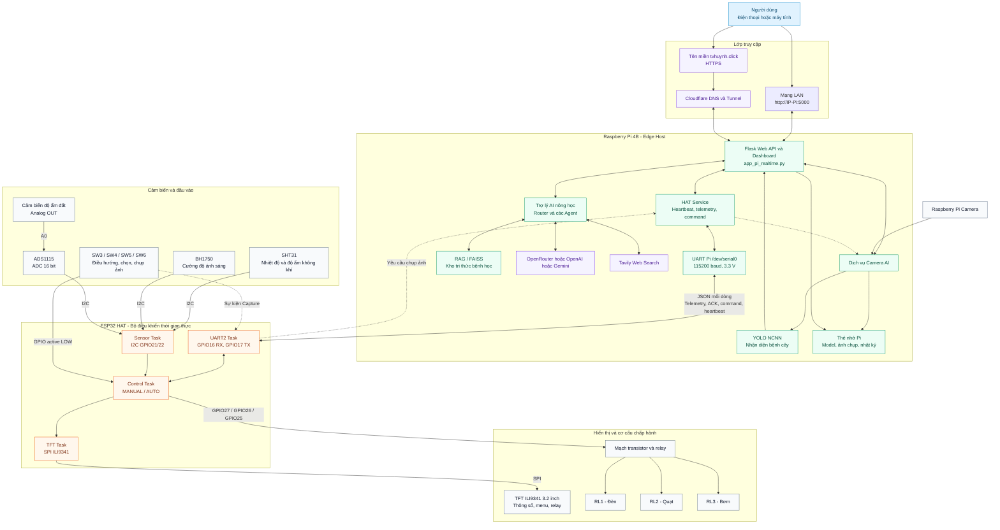

# Flowchart kiến trúc tổng thể TomatoGuard Edge

## Luồng hoạt động chính

1. ESP32 đọc cảm biến qua I2C, xử lý nút nhấn, điều khiển relay và cập nhật TFT.
2. ESP32 và Raspberry Pi trao đổi JSON qua UART 115200 baud; Pi gửi heartbeat và lệnh, ESP32 gửi telemetry và ACK.
3. Raspberry Pi xử lý hình ảnh camera bằng model YOLO NCNN, lưu ảnh và kết quả trên thẻ nhớ.
4. Flask cung cấp dashboard và API trong mạng LAN hoặc qua tên miền Cloudflare.
5. Chatbot kết hợp dữ liệu trạm, kho tri thức FAISS, LLM và Tavily để tư vấn nông học.
6. Khi nhấn Capture, sự kiện đi từ ESP32 sang Pi; Pi chụp ảnh camera và lưu vào thẻ nhớ.

